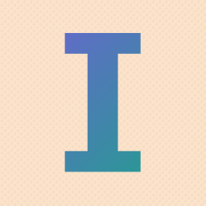

# IconMarker

テキストベースのアイコンを生成するWindows向けGUIツールです。文字にグラデーションを適用し、背景にシェブロン模様を加えた見栄えの良いアイコンをPNG/ICO形式で書き出せます。



## 機能

- テキスト入力（1文字〜複数文字に対応）
- 背景色のカスタマイズ
- シェブロン（ヘリンボーン）模様の背景パターン
- テキストへのグラデーション適用（開始色・終了色を指定）
- パディング調整（0.0〜0.4）でテキストサイズを制御
- 256x256のリアルタイムプレビュー
- PNG出力（256x256）
- ICO出力（16x16, 32x32, 48x48, 256x256 の複数サイズを内包）

## スクリーンショット

```
┌─────────────────────────────────────────────┐
│  IconMarker                                 │
│─────────────────────────────────────────────│
│  Text: [G          ]  │  Preview (256x256)  │
│                       │  ┌──────────────┐   │
│  Background: [■]      │  │              │   │
│  ☑ Chevron pattern    │  │     G        │   │
│                       │  │              │   │
│  Text gradient:       │  └──────────────┘   │
│    Start: [■]  End:[■]│                     │
│                       │                     │
│  Padding: [===○===]   │                     │
│                       │                     │
│  [Save PNG] [Save ICO]│                     │
└─────────────────────────────────────────────┘
```

## 必要環境

- Windows 10/11
- Rust 1.70+
- システムフォント（以下のいずれか）:
  - Meiryo Bold (`meiryob.ttc`)
  - Yu Gothic Bold (`YuGothB.ttc`)
  - MS Gothic (`msgothic.ttc`)
  - Arial Bold / Arial

## ビルド・実行

```bash
# ビルド
cargo build --release

# 実行
cargo run --release
```

## 使い方

1. **Text** 欄にアイコンにしたい文字を入力
2. **Background** でベースの背景色を選択
3. **Chevron pattern** チェックボックスで背景模様のON/OFFを切替
4. **Text gradient** の Start / End でテキストのグラデーション色を設定
5. **Padding** スライダーでテキスト周囲の余白を調整
6. 右側のプレビューでリアルタイムに結果を確認
7. **Save PNG** または **Save ICO** ボタンで書き出し

## 技術詳細

| 項目 | 内容 |
|------|------|
| 言語 | Rust (Edition 2021) |
| GUI | eframe / egui |
| 画像処理 | image, imageproc, ab_glyph |
| ICO生成 | ico crate |
| ファイルダイアログ | rfd |

## ライセンス

MIT
